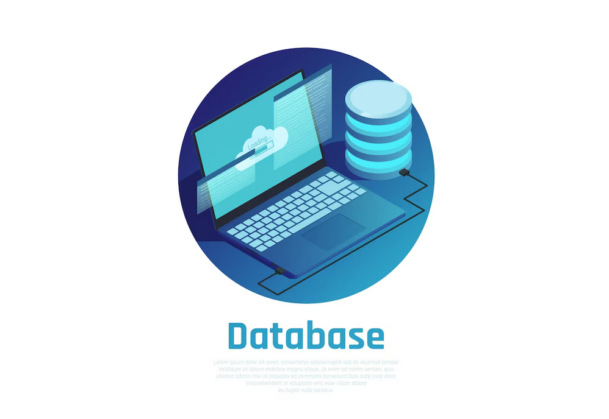

# Base de Datos para Aplicaciones

---

En este repositorio se pueden encontrar temas y ejercicios de base de datos para aplicaaciones tales como:

1. Consultas Avanzadas con Joins
1. Vistas (Views)
1. Procedimientos Almacenados (Store Procedures)
1. Disparadores (Triggers)
1. Manejo de Transacciones
1. Seguridad de Base de Datos
1. Despliegue de Aplicaciones

